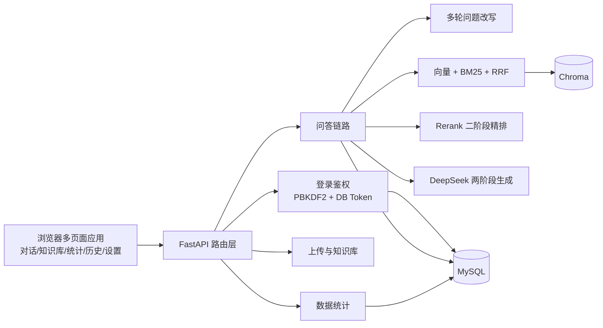

# RAG 智能问答系统

[](https://github.com/fwh1206/rag-qa-system/actions/workflows/ci.yml)

基于 **FastAPI + Chroma + DeepSeek/任意 OpenAI 兼容模型** 的本地知识库问答系统。上传 PDF、Word、Excel、Markdown、TXT、JSON 等文档后自动完成解析、中文切分、向量化入库；提问时先做「向量 + BM25 混合检索 + RRF 融合 + Rerank 二阶段精排」，再通过两阶段提示词让大模型生成自然、可溯源的回答，支持 SSE 流式输出与多轮追问改写。每个用户的知识库互相隔离，普通用户只能检索和查看自己上传的文档，管理员可查看全站；前端采用独立登录页 + 专注式会话工作台，知识库、统计、历史、个人中心与系统设置各自成页。

## 核心特性

- 文档知识库：支持 `pdf / txt / docx / doc / md / xlsx / xls / json`，单文件最大 20MB，可手动粘贴文本入库；`.doc` 优先调用本机 Word，缺失时自动切换到 WPS 解析
- 知识库用户隔离：文件、向量、图谱缓存均带归属用户，普通用户只能看到自己的文档；管理员可查看并管理全站
- 中文感知切分：基于 LangChain `RecursiveCharacterTextSplitter`，按段落、句子、中文标点优先级切分，参数在线可调
- 混合检索：`bge-small-zh` 语义召回 + `jieba` 分词 BM25 关键词召回，RRF 融合并做源级保底
- 二阶段精排：`bge-reranker-v2-m3` CrossEncoder 对混合召回候选重新打分，形成「召回 → 精排 → 生成」三阶段链路，可开关、失败自动降级
- 多轮问题改写：有历史会话时先改写追问再检索，缓解"那价格呢"这类指代问题
- 多模型兼容：系统默认模型 + 每个用户可配置自己的 OpenAI 兼容模型（DeepSeek / OpenAI / 本地网关等），API Key 加密存储
- 两阶段生成：先让大模型生成思考过程，再把思考结果拼入 Prompt 生成最终答案，支持开关与失败降级
- 流式输出：`/chat/stream` 以 SSE 逐段返回来源、思考与回答，前端实时渲染
- 自然语言回答：Prompt 采用自然对话风格，避免"客服腔"与强制编号，回答更像真人，来源通过可折叠卡片溯源（含文件名、片段序号、相似度与 Rerank 分数）
- Markdown 富文本回答：复用 `marked` + `DOMPurify` + `highlight.js`，回答按 Markdown 渲染、代码块高亮，并保留 `[来源N]` 可点击引文
- 知识图谱：上传和问答时由 AI 抽取文档实体与关系，右侧面板用 Cytoscape 渲染图谱
- 思考过程可见：默认开启两阶段思考，聊天消息内以可折叠“思考过程”块展示 AI 推理
- 多页面前端：独立登录页 / 对话工作台 / 知识库管理 / 数据统计 / 历史记录 / 个人中心 / 系统设置，首页不再堆叠上传、用户管理与设置弹窗，顶部导航与用户菜单统一跳转，公共 CSS/JS 抽离复用
- 数据统计：`/stats/overview` 汇总文档数、向量片段数、对话量、会话数、用户数与最近对话；`/stats/trend` 提供近 N 日对话趋势，由 Chart.js 渲染
- 用户与权限：邮箱验证码注册、邮箱/用户名密码登录、邮箱验证码登录、邮箱验证码找回密码、个人中心绑定邮箱、管理员用户管理，系统设置页可配置 SMTP 并发送测试邮件，`admin / user` 两种角色，会话按用户隔离
- 检索评测：76 条评测集，一键对比纯向量、纯 BM25、混合检索三路基线的 Recall@K / Precision@K / MRR
- 工程化：MySQL 持久化、Docker Compose 一键部署、GitHub Actions 自动化测试（67 个用例，覆盖率 71%+）
- 安全加固：登录只校验 MySQL 用户表，默认管理员不再绕过数据库；登录/验证码/注册接口加入内存限流；LLM 调用支持自动重试与退避

## 技术栈

| 分类 | 技术 |
| --- | --- |
| 后端框架 | FastAPI + Uvicorn |
| 向量数据库 | Chroma（本地持久化，余弦距离） |
| 嵌入模型 | sentence-transformers / BAAI/bge-small-zh |
| 精排模型 | sentence-transformers CrossEncoder / BAAI/bge-reranker-v2-m3 |
| 大模型 | DeepSeek 或任意 OpenAI 兼容 Chat Completion（同步 + SSE 流式，系统设置可配置） |
| 混合检索 | rank-bm25 + jieba，RRF 融合 |
| 关系数据库 | MySQL（pymysql + DBUtils 连接池） |
| 文档解析 | pypdf、python-docx、openpyxl、xlrd、langchain-text-splitters |
| 前端 | 原生 HTML/CSS/JavaScript 多页面应用（共享样式与公共模块；内置 marked / DOMPurify / highlight.js / Chart.js / Cytoscape.js） |

## 开源选型与复用

优化前先对 GitHub 上的成熟 RAG 项目做了横向对比：RAGFlow（Apache-2.0、活跃）在落地引文与切片可视化上最值得借鉴；AnythingLLM（MIT、活跃）的「Markdown 渲染 + DOMPurify 净化」组合是回答展示的成熟范式，其历史安全通告也再次验证了净化层不可省略；FastGPT 使用自定义许可证并明确限制对外提供 SaaS，不适合无约束复用；Dify 功能完整但技术栈与基础设施过重，整仓接入当前项目的适配成本明显高于收益。

结论是不整仓替换，只取适合本项目架构的成熟组件：

| 组件 | 版本 | 许可证 | 复用方式 |
| --- | --- | --- | --- |
| marked | 18.0.9 | MIT | 回答 Markdown 渲染 |
| DOMPurify | 3.4.13 | MPL-2.0 OR Apache-2.0 | 渲染结果 HTML 净化，防 XSS |
| highlight.js | 11.12.0 | BSD-3-Clause | 回答内代码块语法高亮 |
| Chart.js | 4.5.1 | MIT | 统计页近 7 日对话趋势 |
| Cytoscape.js | 3.34.1 | MIT | 问答侧栏知识图谱渲染 |

这些文件本地化到 `static/vendor/`，运行时不依赖外部 CDN，许可证原文保存在 `static/vendor/licenses/`。

## 项目差异化

- **用户级知识库隔离**：上传文件、向量、分组、图谱缓存均按用户隔离，普通用户只能检索自己的文档，管理员可管理全站；这是多数“单库共享”演示项目没有的权限闭环。
- **检索链路可解释**：向量 + BM25 + RRF + 源级保底 + Rerank，`/kb/test` 能直接看到每个命中的向量相似度、BM25 分数和精排分数，便于定位召回问题。
- **两阶段生成 + 思考可见**：先输出思考过程再生成答案，思考与来源一起落库、导出，回答过程不是黑盒。
- **真实账号体系**：邮箱验证码注册/登录/找回密码、每用户自带 OpenAI 兼容模型 API Key、管理员/普通用户权限隔离。
- **轻量可维护**：单机可跑、原生前端、无重型框架依赖，组件级复用成熟开源库；需要扩容时再按性能与扩展设计章节升级。

## 角色权限

| 能力 | 管理员 | 普通用户 |
| --- | --- | --- |
| 查看自己的会话与问答历史 | 可以 | 可以 |
| 查看全部用户的会话与问答历史 | 可以 | 不可以 |
| 查看全站最近对话 / 系统范围统计 | 可以 | 不可以 |
| 查看个人使用统计 | 可以（系统范围） | 可以（仅本人） |
| 上传文档、知识库问答 | 可以 | 可以 |
| 删除/清空/重建自己的知识库 | 可以 | 可以（仅本人） |
| 查看并管理全部用户的知识库 | 可以 | 不可以 |
| 修改系统配置、SMTP 邮箱服务 | 可以 | 不可以 |
| 用户管理（新增/角色/重置密码/删除） | 可以 | 不可以 |

## 架构



## 检索效果评测

评测集 76 条，覆盖精确关键词、语义改写与跨 chunk 问题，Top-3 结果：

| 检索方式 | Recall@3 | Precision@3 | MRR |
| --- | --- | --- | --- |
| 纯向量（bge-small-zh） | 0.8947 | 0.3070 | 0.8114 |
| 纯 BM25（jieba 分词） | 0.9211 | 0.3158 | 0.8662 |
| 混合检索（RRF 融合） | **0.9737** | **0.3333** | **0.8947** |

混合检索三项指标均优于单路：RRF 同分时优先双路命中，并对两路 top1 做源级保底；BM25 分词统一小写并补充英文/数字词元，避免 `SSE`、`RRF` 等缩写漏召回。

> 注意：Precision@3 仅为 `0.3333`，意味着每召回 3 个片段中约 1 个是相关片段。当前评测集是自建的 76 条内部回归集，未对标 CMRC/BEIR 等公开标准集，指标适合做版本间回归对比，不能直接代表生产效果。后续会补充公开数据集与 RAGAS/LLM-as-judge 的答案质量评测。

## 快速开始

### 本地启动

```powershell
python -m venv venv
.\venv\Scripts\Activate.ps1
pip install -r requirements.txt
Copy-Item .env.example .env
```

编辑 `.env` 填写 `DEEPSEEK_API_KEY` 与 MySQL 连接信息，然后启动：

```powershell
python main.py
```

浏览器访问 <http://127.0.0.1:8000>，默认账号 `admin / admin123`。

### VSCode 调试

仓库已内置 `.vscode/launch.json`，在 VSCode 中打开项目根目录后：

1. 打开左侧“运行和调试”面板，选择 `RAG问答系统 (uvicorn)`；
2. 按 `F5` 启动调试；
3. 等调试控制台出现 `Uvicorn running on http://127.0.0.1:8000` 后，访问 <http://127.0.0.1:8000>。

调试配置未使用 `--reload`，避免 uvicorn 热重载子进程导致断点失效。需要热重载时在终端手动运行：

```powershell
.\venv\Scripts\python.exe -m uvicorn main:app --host 127.0.0.1 --port 8000 --reload
```

### Docker Compose

```powershell
Copy-Item .env.example .env
docker compose up -d --build
```

服务启动后访问 <http://localhost:8000>。`data/`、`vector_db/`、`logs/` 挂载到宿主机，MySQL 数据保存在 Docker volume。

### 初始化样例知识库

仓库自带 6 份样例文档，位于 `data/samples/`（与用户上传区分离，清空知识库不会影响样例）。运行下面的脚本会覆盖样例对应索引，但不会删除各用户自己上传的知识库：

```powershell
.\venv\Scripts\python.exe scripts\index_samples.py
```

## 环境变量

| 变量 | 默认值 | 说明 |
| --- | --- | --- |
| `DEEPSEEK_API_KEY` | 空 | DeepSeek API Key，必填 |
| `DEEPSEEK_MODEL` | `deepseek-chat` | 大模型名称 |
| `DEEPSEEK_URL` | DeepSeek 官方地址 | OpenAI 兼容接口地址 |
| `RAG_AUTH_ENABLED` | `1` | 设为 `0` 关闭登录鉴权 |
| `RAG_AUTH_USER` | `admin` | 默认管理员用户名 |
| `RAG_AUTH_PASSWORD` | `admin123` | 默认管理员密码 |
| `RAG_AUTH_TOKEN_TTL` | `86400` | token 有效期（秒） |
| `RAG_EMAIL_SMTP_HOST` | 空 | SMTP 服务器；为空时本地开发模式直接返回验证码 |
| `RAG_EMAIL_SMTP_PORT` | `465` | SMTP 端口 |
| `RAG_EMAIL_SMTP_USER` / `RAG_EMAIL_SMTP_PASSWORD` | 空 | SMTP 账号与授权码 |
| `RAG_EMAIL_FROM` | 空 | 发件人地址，默认使用 SMTP 账号 |
| `RAG_EMAIL_USE_SSL` | `1` | 使用 SSL；设为 `0` 时改用 STARTTLS |
| `RAG_EMAIL_CODE_TTL` | `600` | 邮箱验证码有效期（秒） |
| `RAG_EMAIL_DEV_MODE` | `0` | 仅本地调试用；设为 `1` 时未配置 SMTP 也会回显验证码 |
| `RAG_DB_HOST` | `127.0.0.1` | MySQL 地址 |
| `RAG_DB_PORT` | `3306` | MySQL 端口 |
| `RAG_DB_USER` | `root` | MySQL 用户 |
| `RAG_DB_PASSWORD` | `root` | MySQL 密码 |
| `RAG_DB_NAME` | `rag_qa_db` | 数据库名 |
| `RAG_DB_CHARSET` | `utf8mb4` | 数据库字符集 |
| `RAG_DB_POOL_SIZE` | `8` | 连接池最大连接数 |
| `RAG_CORS_ORIGINS` | 本地地址 | 跨域白名单，逗号分隔 |

切片大小、重叠、召回数、相似度阈值、温度、思考开关、多轮改写开关、精排开关与 Prompt 模板可在运行界面调整并持久化到 `config/rag_config.json`。

## 项目结构

```text
rag问答系统/
├── main.py                  # FastAPI 入口
├── pyproject.toml           # pytest / ruff 配置
├── requirements.txt         # 运行依赖
├── requirements-dev.txt     # 开发依赖（pytest / ruff）
├── .env.example             # 环境变量模板
├── Dockerfile / docker-compose.yml
├── config/
│   ├── settings.py          # 全局配置，支持 .env
│   ├── rag_config.py        # 运行时 RAG 配置读写与校验
│   ├── llm_config.py        # 系统大模型配置读写（环境变量 + JSON 覆盖）
│   └── email_config.py      # SMTP 邮箱配置读写
├── core/
│   ├── auth.py              # 数据库持久化 token 鉴权
│   ├── database.py          # MySQL 数据层（懒加载连接池）
│   ├── llm_client.py        # OpenAI 兼容大模型同步/流式调用
│   ├── query_rewrite.py     # 多轮问题改写
│   ├── rag_engine.py        # 切分、Embedding、Chroma、混合检索与精排
│   ├── emailer.py           # 邮箱验证码发送（smtplib）
│   ├── kg_builder.py        # AI 实体/关系抽取与图谱缓存
│   ├── secret_box.py        # 用户 API Key 本地加密/解密
│   └── logger.py            # 滚动日志
├── api/
│   ├── auth_router.py       # 登录/注册/邮箱验证码/用户管理
│   ├── chat_router.py       # 问答与 SSE 流式输出
│   ├── file_router.py       # 上传与用户隔离的知识库管理
│   ├── history_router.py    # 会话历史/导出
│   ├── config_router.py     # 运行/大模型/邮箱配置
│   ├── stats_router.py      # 数据统计（按角色隔离）
│   └── kg_router.py         # 知识图谱抽取与缓存
├── utils/                   # 文件解析、元数据、评测指标
├── static/
│   ├── index.html           # 对话工作台（首页）
│   ├── login.html           # 独立登录/注册页
│   ├── kb.html              # 知识库管理页
│   ├── stats.html           # 数据统计页
│   ├── history.html         # 历史记录页
│   ├── profile.html         # 个人中心页
│   ├── settings.html        # 系统设置页
│   ├── css/app.css          # 公共样式（含顶部导航）
│   ├── js/common.js         # 公共前端模块（鉴权/API/导航/工具）
│   ├── js/chat.js           # 会话工作台逻辑
│   ├── js/login.js          # 登录/注册页逻辑
│   └── vendor/              # 本地化开源前端库与许可证
├── data/
│   ├── samples/             # 内置样例文档（6 份，与上传区隔离）
│   ├── eval_set.json        # 检索评测集（76 条）
│   ├── users/               # 运行时每个用户自己的上传目录（不提交 Git）
│   ├── kg/                  # 知识图谱缓存（不提交 Git）
│   └── file_meta.json       # 文件分组与归属元数据（不提交 Git）
├── scripts/
│   ├── eval_retrieval.py    # 三路基线检索评测
│   ├── index_samples.py     # 初始化样例知识库
│   └── devtools/            # 一次性开发改造工具
├── tests/                   # pytest 单测（67 个用例）
└── docs/
    ├── 设计文档.md
    ├── 部署指南.md
    └── RAG系统开发记录.md
```

## 主要接口

除登录接口外，业务接口均需要请求头 `X-Auth-Token`。

| 方法 | 路径 | 权限 | 说明 |
| --- | --- | --- | --- |
| POST | `/auth/login` | 公开 | 登录 |
| POST | `/auth/send-code` | 公开 | 发送注册/登录邮箱验证码 |
| POST | `/auth/login-code` | 公开 | 邮箱验证码登录 |
| POST | `/auth/reset-password` | 公开 | 邮箱验证码重置密码 |
| POST | `/auth/logout` | 公开 | 退出登录 |
| GET | `/auth/me` | 登录 | 当前用户 |
| POST | `/auth/me/email` | 登录 | 绑定当前账号邮箱 |
| GET/PUT | `/auth/me/llm` | 登录 | 读取/保存当前用户自己的大模型配置 |
| POST | `/auth/me/llm/test` | 登录 | 测试当前用户的大模型配置 |
| POST | `/auth/register` | 公开 | 自助注册 |
| GET/POST | `/auth/users` | 管理员 | 用户列表 / 创建 |
| PUT/DELETE | `/auth/users/{username}` | 管理员 | 修改 / 删除用户 |
| POST | `/chat` | 登录 | 非流式问答 |
| POST | `/chat/stream` | 登录 | SSE 流式问答 |
| POST | `/upload` | 登录 | 文件上传入库 |
| POST | `/upload_text` | 登录 | 文本入库 |
| GET | `/kb/list` | 登录 | 文件分页列表 |
| GET | `/kb/categories` | 登录 | 分组汇总 |
| GET | `/kb/preview` | 登录 | 文档预览 |
| GET | `/kb/test` | 登录 | 混合检索测试 |
| DELETE | `/kb/delete` | 登录 | 删除文件（普通用户仅本人，管理员全站） |
| DELETE | `/kb/clear_all` | 登录 | 清空知识库（普通用户仅本人，管理员全站） |
| POST | `/kb/reindex` | 登录 | 重建索引（普通用户仅本人，管理员全站） |
| GET | `/history/list` | 登录 | 历史分页 |
| DELETE | `/history/clear` | 登录 | 清空会话 |
| GET | `/history/export` | 登录 | 导出 md/json |
| GET | `/sessions/list` | 登录 | 会话列表（按用户隔离） |
| PUT | `/sessions/rename` | 登录 | 重命名会话 |
| GET/PUT | `/config` | 读登录 / 写管理员 | 运行配置 |
| POST | `/config/reset` | 管理员 | 恢复默认配置 |
| GET/PUT | `/config/email` | 管理员 | 读取/保存 SMTP 邮箱配置 |
| POST | `/config/email/test` | 管理员 | 发送测试邮件验证 SMTP 连通性 |
| GET/PUT | `/config/llm` | 管理员 | 读取/保存 OpenAI 兼容大模型配置 |
| POST | `/config/llm/test` | 管理员 | 测试大模型接口连通性 |
| POST | `/kg/extract` | 登录 | AI 抽取文档实体与关系并缓存图谱 |
| GET/DELETE | `/kg/file` | 登录 | 读取/删除文档知识图谱 |
| GET | `/stats/overview` | 登录 | 系统运行概况统计 |
| GET | `/stats/trend` | 登录 | 近 N 日对话趋势（默认 7 天） |
| GET | `/stats/recent` | 登录 | 最近对话摘要 |
| GET | `/stats/me` | 登录 | 个人使用统计（管理员返回全站） |

## 前端页面

| 路由 | 页面 | 功能 |
| --- | --- | --- |
| `/login` | 登录/注册/找回密码 | 密码登录、验证码登录、邮箱注册、邮箱验证码重置密码 |
| `/` | 对话工作台 | 流式问答、会话列表、来源引用侧栏、Markdown 回答、复制含来源、导出/清空 |
| `/kb` | 知识库管理 | 文件上传/拖拽、分组筛选、预览、删除、检索测试、重建索引 |
| `/stats` | 数据统计 | 文档数、向量片段、对话量、会话数、用户数、近 7 日趋势图、最近对话 |
| `/history` | 历史记录 | 按会话分页浏览问答记录，导出 Markdown，清空 |
| `/profile` | 个人中心 | 账号信息、绑定邮箱、我的模型服务、我的会话、最近动态、密码修改、偏好设置、数据工具 |
| `/settings` | 系统设置 | 提示词模板、检索/生成参数、功能开关、恢复默认 |

## 评测与测试

```powershell
# 三路基线对比（Recall@K / Precision@K / MRR）
.\venv\Scripts\python.exe scripts\eval_retrieval.py --eval data\eval_set.json --top-k 3

# 单元测试
.\venv\Scripts\python.exe -m pytest tests -q
```

评测集为 JSON 数组，每条包含 `question` 与 `expected`（期望命中的文件与片段）：

```json
[
  {
    "question": "云帆平台包含哪些核心模块？",
    "expected": [
      {"filename": "公司产品手册.md", "chunk_index": 0}
    ]
  }
]
```

## 安全说明

- 密码使用 PBKDF2-SHA256 + 随机盐存储
- 用户自带的 LLM API Key 使用 Fernet 本地密钥加密后存 MySQL，接口不回显明文
- 邮箱验证码只保存 SHA-256 哈希，10 分钟过期、一次性使用；未配置 SMTP 时开发模式才会把验证码返回给前端
- token 以 SHA-256 哈希形式持久化到 MySQL，支持多实例部署与登出撤销
- 登录不再使用环境变量默认管理员兜底，只有 MySQL 用户表中真实存在的用户才能登录；`init_db` 会在空库时创建管理员
- 登录、邮箱验证码发送、注册接口均带滑动窗口限流，避免简单暴破与验证码轰炸
- LLM 调用对连接错误、超时、429/5xx 自动重试并指数退避，流式连接阶段同样生效
- 会话按用户隔离，管理员可访问全部会话
- 知识库按用户隔离：上传文件、向量元数据、分组与图谱缓存均带归属用户，普通用户只能访问自己的文档
- 上传文件名清洗防路径穿越，单文件限制 20MB，解析失败清理临时文件
- CORS 白名单、API Key、MySQL 配置均通过环境变量控制，不硬编码

## 性能与扩展设计

当前定位是**单机、中小规模知识库**：Chroma 本地持久化、BM25 内存索引按需构建（只在文件增删后失效重建）、Embedding 结果进程内 LRU 缓存、LLM 同步调用 + 线程池。该设计在数百份文档、个位数 QPS 场景下简单可靠，但不适合直接声称支持“1 万份文档、100 QPS”。

如果要应对更大规模，演进方向如下：

| 瓶颈 | 现状 | 升级方向 |
| --- | --- | --- |
| 向量检索 | Chroma 单节点 | 迁移 Milvus / Qdrant / pgvector，支持分片与副本 |
| 关键词检索 | 内存 BM25 全量重建 | 使用 Elasticsearch / Meilisearch 或增量倒排索引 |
| 嵌入缓存 | 进程内 OrderedDict | Redis 共享缓存，多实例复用 embedding 与精排结果 |
| LLM 调用 | 同步 requests + 线程池 | 异步 httpx/OpenAI SDK、超时/熔断/配额、流式断点续传 |
| 限流与防刷 | 进程内滑动窗口 | Redis 分布式限流 + 登录验证码 |
| 可观测性 | 文件滚动日志 | 结构化日志、指标端点、OpenTelemetry 链路追踪 |
| 任务队列 | 同步入库 | Celery / RQ 异步解析与索引，上传立即返回 |

## 已知限制与路线图

- 扫描版 PDF 暂不支持 OCR，仅解析文本层
- 旧版 `.doc` 解析依赖本机安装 Microsoft Word 或 WPS（Windows），Linux/Docker 容器内请先转换为 `.docx`
- Chroma 为本地单机向量库，数据量大时可迁移 Milvus/Weaviate
- 限流器为进程内实现，多实例部署时需要迁移到 Redis
- SSE 中断目前不会自动续答，会向前端发送错误事件；后续可加入请求级断点续传
- 知识库已按用户隔离，后续可继续扩展文档级分享与分组授权
- 检索评测聚焦召回阶段，后续可补充 RAGAS / LLM-as-judge 的答案质量评测
- 前端为原生 JS 多页面应用，后续可迁移 Vue/React + 组件库提升交互复杂度
