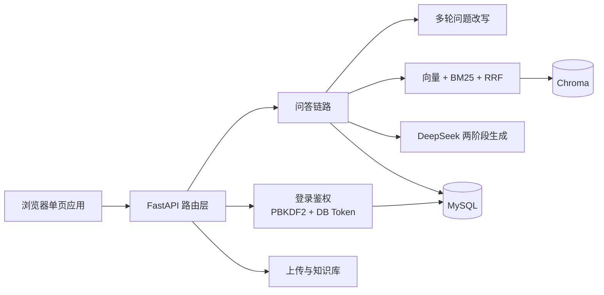

# RAG 智能问答系统

[](https://github.com/fwh1206/rag-qa-system/actions/workflows/ci.yml)

基于 **FastAPI + Chroma + DeepSeek** 的本地知识库问答系统。上传 PDF、Word、Excel、Markdown、TXT 等文档后自动完成解析、中文切分、向量化入库；提问时先做「向量 + BM25 混合检索 + RRF 融合」，再通过两阶段提示词让大模型生成带来源标注的回答，支持 SSE 流式输出与多轮追问改写。

## 核心特性

- 文档知识库：支持 `pdf / txt / docx / md / xlsx / xls`，单文件最大 20MB，可手动粘贴文本入库
- 中文感知切分：基于 LangChain `RecursiveCharacterTextSplitter`，按段落、句子、中文标点优先级切分，参数在线可调
- 混合检索：`bge-small-zh` 语义召回 + `jieba` 分词 BM25 关键词召回，RRF 融合并做源级保底
- 多轮问题改写：有历史会话时先改写追问再检索，缓解“那价格呢”这类指代问题
- 两阶段生成：先让大模型生成思考过程，再把思考结果拼入 Prompt 生成最终答案，支持开关与失败降级
- 流式输出：`/chat/stream` 以 SSE 逐段返回来源、思考与回答，前端实时渲染
- 来源溯源：命中片段标注 `[来源N]`，前端可查看文件名、片段序号、相似度与 BM25 分数
- 用户与权限：登录、注册、管理员用户管理，`admin / user` 两种角色，会话按用户隔离
- 检索评测：76 条评测集，一键对比纯向量、纯 BM25、混合检索三路基线的 Recall@K / Precision@K / MRR
- 工程化：MySQL 持久化、Docker Compose 一键部署、GitHub Actions 自动化测试

## 技术栈

| 分类 | 技术 |
| --- | --- |
| 后端框架 | FastAPI + Uvicorn |
| 向量数据库 | Chroma（本地持久化，余弦距离） |
| 嵌入模型 | sentence-transformers / BAAI/bge-small-zh |
| 大模型 | DeepSeek Chat Completion（同步 + SSE 流式） |
| 混合检索 | rank-bm25 + jieba，RRF 融合 |
| 关系数据库 | MySQL（pymysql + DBUtils 连接池） |
| 文档解析 | PyPDF2、python-docx、openpyxl、xlrd、langchain-text-splitters |
| 前端 | 原生 HTML/CSS/JavaScript 单页应用 |

## 架构



## 检索效果评测

评测集 76 条，覆盖精确关键词、语义改写与跨 chunk 问题，Top-3 结果：

| 检索方式 | Recall@3 | Precision@3 | MRR |
| --- | --- | --- | --- |
| 纯向量（bge-small-zh） | 0.8947 | 0.3070 | 0.8114 |
| 纯 BM25（jieba 分词） | 0.9211 | 0.3158 | 0.8662 |
| 混合检索（RRF 融合） | **0.9737** | **0.3333** | **0.8947** |

混合检索三项指标均优于单路：RRF 同分时优先双路命中，并对两路 top1 做源级保底；BM25 分词统一小写并补充英文/数字词元，避免 `SSE`、`RRF` 等缩写漏召回。

## 快速开始

### 本地启动

```powershell
python -m venv venv
.\venv\Scripts\Activate.ps1
pip install -r requirements.txt
Copy-Item .env.example .env
```

编辑 `.env` 填写 `DEEPSEEK_API_KEY` 与 MySQL 连接信息，然后启动：

```powershell
python main.py
```

浏览器访问 <http://127.0.0.1:8000>，默认账号 `admin / admin123`。

### Docker Compose

```powershell
Copy-Item .env.example .env
docker compose up -d --build
```

服务启动后访问 <http://localhost:8000>。`data/`、`vector_db/`、`logs/` 挂载到宿主机，MySQL 数据保存在 Docker volume。

### 初始化样例知识库

仓库自带的 7 份样例文档位于 `data/`，重建向量索引：

```powershell
.\venv\Scripts\python.exe scripts\index_samples.py
```

## 环境变量

| 变量 | 默认值 | 说明 |
| --- | --- | --- |
| `DEEPSEEK_API_KEY` | 空 | DeepSeek API Key，必填 |
| `DEEPSEEK_MODEL` | `deepseek-chat` | 大模型名称 |
| `DEEPSEEK_URL` | DeepSeek 官方地址 | OpenAI 兼容接口地址 |
| `RAG_AUTH_ENABLED` | `1` | 设为 `0` 关闭登录鉴权 |
| `RAG_AUTH_USER` | `admin` | 默认管理员用户名 |
| `RAG_AUTH_PASSWORD` | `admin123` | 默认管理员密码 |
| `RAG_AUTH_TOKEN_TTL` | `86400` | token 有效期（秒） |
| `RAG_DB_HOST` | `127.0.0.1` | MySQL 地址 |
| `RAG_DB_PORT` | `3306` | MySQL 端口 |
| `RAG_DB_USER` | `root` | MySQL 用户 |
| `RAG_DB_PASSWORD` | `root` | MySQL 密码 |
| `RAG_DB_NAME` | `rag_qa_db` | 数据库名 |
| `RAG_CORS_ORIGINS` | 本地地址 | 跨域白名单，逗号分隔 |

切片大小、重叠、召回数、相似度阈值、温度、思考开关、多轮改写开关与 Prompt 模板可在运行界面调整并持久化到 `config/rag_config.json`。

## 项目结构

```text
rag问答系统/
├── main.py                  # FastAPI 入口
├── requirements.txt         # 运行依赖
├── Dockerfile / docker-compose.yml
├── config/
│   ├── settings.py          # 全局配置，支持 .env
│   ├── rag_config.py        # 运行时 RAG 配置读写与校验
│   └── rag_config.json      # 运行时配置持久化
├── core/
│   ├── auth.py              # 数据库持久化 token 鉴权
│   ├── database.py          # MySQL 数据层（懒加载连接池）
│   ├── llm_client.py        # DeepSeek 同步/流式调用
│   ├── query_rewrite.py     # 多轮问题改写
│   ├── rag_engine.py        # 切分、Embedding、Chroma、混合检索
│   └── logger.py
├── api/                     # 路由层
├── utils/                   # 文件解析、元数据、评测指标
├── static/index.html        # 前端单页应用
├── data/                    # 上传文档与评测集（样例文档 + eval_set.json）
├── scripts/
│   ├── eval_retrieval.py    # 三路基线检索评测
│   └── index_samples.py     # 重建样例知识库
├── tests/                   # pytest 单测
└── docs/设计文档.md
```

## 主要接口

除登录接口外，业务接口均需要请求头 `X-Auth-Token`。

| 方法 | 路径 | 权限 | 说明 |
| --- | --- | --- | --- |
| POST | `/auth/login` | 公开 | 登录 |
| POST | `/auth/logout` | 公开 | 退出登录 |
| GET | `/auth/me` | 公开 | 当前用户 |
| POST | `/auth/register` | 公开 | 自助注册 |
| GET/POST | `/auth/users` | 管理员 | 用户列表 / 创建 |
| PUT/DELETE | `/auth/users/{username}` | 管理员 | 修改 / 删除用户 |
| POST | `/chat` | 登录 | 非流式问答 |
| POST | `/chat/stream` | 登录 | SSE 流式问答 |
| POST | `/upload` | 登录 | 文件上传入库 |
| POST | `/upload_text` | 登录 | 文本入库 |
| GET | `/kb/list` | 登录 | 文件分页列表 |
| GET | `/kb/categories` | 登录 | 分组汇总 |
| GET | `/kb/preview` | 登录 | 文档预览 |
| GET | `/kb/test` | 登录 | 混合检索测试 |
| DELETE | `/kb/delete` | 管理员 | 删除文件 |
| DELETE | `/kb/clear_all` | 管理员 | 清空知识库 |
| POST | `/kb/reindex` | 管理员 | 重建索引 |
| GET | `/history/list` | 登录 | 历史分页 |
| DELETE | `/history/clear` | 登录 | 清空会话 |
| GET | `/history/export` | 登录 | 导出 md/json |
| GET | `/sessions/list` | 登录 | 会话列表（按用户隔离） |
| PUT | `/sessions/rename` | 登录 | 重命名会话 |
| GET/PUT | `/config` | 读登录 / 写管理员 | 运行配置 |

## 评测与测试

```powershell
# 三路基线对比（Recall@K / Precision@K / MRR）
.\venv\Scripts\python.exe scripts\eval_retrieval.py --eval data\eval_set.json --top-k 3

# 单元测试
.\venv\Scripts\python.exe -m pytest tests -q
```

评测集为 JSON 数组，每条包含 `question` 与 `expected`（期望命中的文件与片段）：

```json
[
  {
    "question": "云帆平台包含哪些核心模块？",
    "expected": [
      {"filename": "公司产品手册.md", "chunk_index": 0}
    ]
  }
]
```

## 安全说明

- 密码使用 PBKDF2-SHA256 + 随机盐存储
- token 以 SHA-256 哈希形式持久化到 MySQL，支持多实例部署与登出撤销
- 会话按用户隔离，管理员可访问全部会话
- 上传文件名清洗防路径穿越，单文件限制 20MB，解析失败清理临时文件
- CORS 白名单、API Key、MySQL 配置均通过环境变量控制，不硬编码

## 已知限制与路线图

- 扫描版 PDF 暂不支持 OCR，仅解析文本层
- Chroma 为本地单机向量库，数据量大时可迁移 Milvus/Weaviate
- 当前无 rerank 精排，可接入 bge-reranker 做第二阶段重排
- 知识库暂为全库共享，后续可扩展文档级/分组级访问控制
- 检索评测聚焦召回阶段，后续可补充 RAGAS / LLM-as-judge 的答案质量评测
