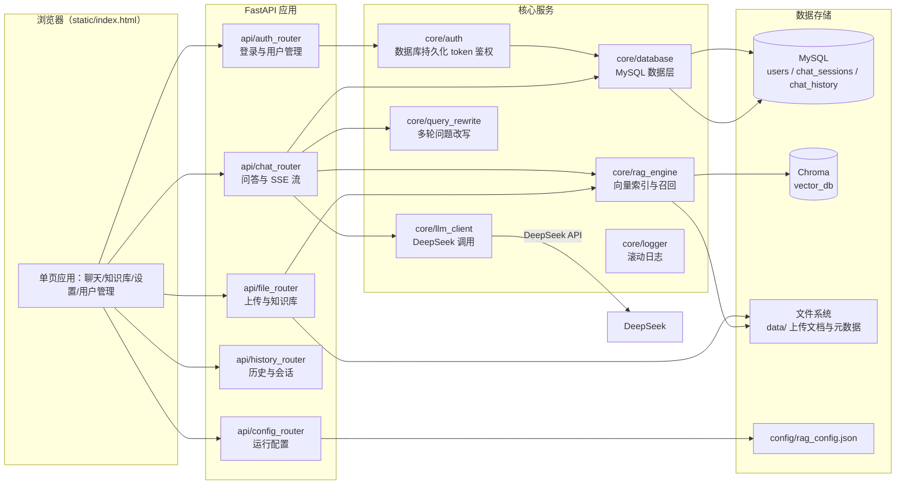
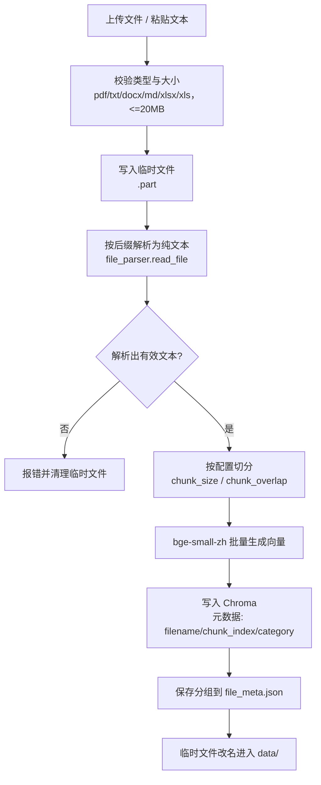

# RAG 智能问答系统设计文档

## 1. 项目概述

本项目是一个面向本地/内网部署的检索增强生成（Retrieval-Augmented Generation，RAG）问答系统。用户上传 PDF、Word、Excel、Markdown、TXT 等文档后，系统完成“解析 -> 切片 -> 向量化 -> 入库”的索引流程；用户提问时，系统先从向量库召回相关知识片段，再调用 DeepSeek 大模型生成带来源标注的答案，支持两阶段思考与 SSE 流式输出。

### 1.1 设计目标

- **知识库易用**：上传即入库，支持常见办公文档格式，中文场景下按语义合理切分。
- **回答可溯源**：召回片段标注来源编号，前端展示命中片段与相似度。
- **多会话体验**：历史记录按会话组织，支持切换、重命名、清空与导出。
- **运行可调**：切片参数、召回参数、Prompt 模板等可在界面调整并持久化。
- **权限可控**：登录鉴权 + 管理员/普通用户角色划分。

## 2. 总体架构



请求经过 FastAPI 路由层进入各业务模块，核心服务层统一访问数据存储。除 `/auth/*` 登录相关接口外，全部业务接口通过 FastAPI 依赖 `require_auth` 校验 `X-Auth-Token`，管理操作再叠加 `require_admin`。

## 3. 核心流程

### 3.1 文档入库链路



同名文件重复上传时，先删除旧向量再写入新向量，实现覆盖更新。Chroma 集合统一使用余弦距离（`hnsw:space=cosine`）；若发现旧集合度量不一致，会自动删除并基于 `data/` 目录重建，同时清理磁盘上已不存在的源文件对应的残留向量。

### 3.2 问答链路

```mermaid
flowchart TD
    A[用户问题] --> B[加载会话记忆<br>最近8轮/2000字]
    B --> C{rewrite_enabled 且有历史?}
    C -->|是| D[多轮问题改写<br>rewrite_query]
    C -->|否| E[原问题]
    D --> F[混合检索<br>向量 + BM25 + RRF]
    E --> F
    F --> G[相似度阈值过滤<br>1 - 余弦距离 >= similarity_threshold]
    G --> H{命中资料?}
    H -->|否且关闭思考| I[直接返回固定提示语<br>不调用大模型]
    H -->|是| J{thinking_enabled?}
    J -->|是| K[阶段一: 生成思考过程<br>llm_chat / llm_chat_stream]
    J -->|否| L
    K --> L[阶段二: 构建最终 Prompt<br>模板 + 历史 + 带[来源N]的资料 + 思考]
    L --> M[DeepSeek 生成回答]
    M --> N[保存 question/answer/thinking 到 MySQL]
    N --> O[返回回答与来源列表<br>流式时按 SSE 事件逐段返回]
```

流式接口的事件顺序为：`sources`（来源）-> `thinking`（思考增量，可选）-> `thinking_done` -> `token`（回答增量）-> `done`（完整回答与思考）。流式中断时发送 `error` 事件。

### 3.3 提示词设计

- **思考阶段 Prompt**：要求模型不直接作答，而是分析用户意图、资料覆盖程度、缺失信息与回答结构，输出不超过 400 字的条目式思考。
- **回答阶段 Prompt**：使用 `config/rag_config.json` 中可编辑的 `prompt_template`，必须包含 `{history}`、`{context}`、`{question}` 占位符；有资料时片段带 `[来源N：文件名#序号]` 标签，无资料时明确提示“未检索到相关参考资料”。
- 思考阶段产出会追加到回答 Prompt 末尾，作为“思考过程”辅助生成。

## 4. 模块设计

### 4.1 入口与配置层

| 文件 | 职责 |
| --- | --- |
| `main.py` | 创建 FastAPI 应用；注册 CORS、静态目录与全部路由；启动时调用 `init_db()` 建表；提供 `GET /` 与 `GET /health` |
| `config/settings.py` | 集中定义路径、默认 RAG 参数、DeepSeek 与 MySQL 配置、鉴权开关；启动时自动创建 `data/`、`vector_db/`、`logs/` 目录 |
| `config/rag_config.py` | 运行配置的读取、校验与 JSON 持久化；线程锁保证并发安全；`save_config` 采用“临时文件 + 原子替换”；提供 `build_prompt` 模板填充 |

### 4.2 鉴权模块（`core/auth.py`）

- token 使用 `secrets.token_hex(32)` 生成，保存在进程内存字典中，有效期 24 小时，读写加线程锁，每次校验前清理过期 token。
- `login` 优先校验 MySQL `users` 表（PBKDF2-SHA256 密码哈希），数据库无此用户时兼容默认管理员账号。
- `require_auth` / `require_admin` 作为 FastAPI 依赖保护业务接口；`RAG_AUTH_ENABLED=0` 时所有接口按 guest/admin 放行。
- 局限：token 不持久化，服务重启后全部失效；多实例部署需替换为 Redis 等共享存储。

### 4.3 数据层（`core/database.py`）

使用 `DBUtils.PooledDB` 维护 MySQL 连接池（最多 8 个连接）。主要能力：

- 建表与旧库字段补齐（`thinking`、`created_at` 缺失时自动 `ALTER`）。
- 用户管理：创建、查询、列表、改角色、改密码、删除，以及“至少保留一个管理员”等业务约束。
- 会话管理：`ensure_session` 自动建会话，`list_sessions` 联表统计消息数。
- 历史管理：分页查询、清空、最近 N 轮记忆加载（默认 8 轮 / 2000 字符截断）。

### 4.4 大模型客户端（`core/llm_client.py`）

- 统一封装 DeepSeek Chat Completion 接口，请求头携带 Bearer Key。
- 同步调用：连接超时 10 秒、读取超时 90 秒。
- 流式调用：`stream=True` 逐行解析 SSE，`data: [DONE]` 结束，异常统一转为 500 并写日志。
- 模型名与 Key 均支持环境变量覆盖。

### 4.5 向量引擎（`core/rag_engine.py`）

- 嵌入模型：`BAAI/bge-small-zh`，懒加载并全局缓存。
- 向量库：Chroma `PersistentClient`，集合名 `knowledge_base`，余弦度量。
- 入库：按配置切分 -> 批量 encode -> 写入 Chroma，元数据含文件名、片段序号、分组。
- 召回：问题编码后按余弦距离排序，返回文档、距离与元数据；支持按分组 `where` 过滤。
- 一致性：`_reconcile_stale_vectors` 删除源文件已消失的向量；`_reindex_uploaded_files` 在集合重建时恢复全量索引。
- 文件列表：汇总 `data/` 磁盘文件与向量切片数，支持分页与分组过滤。

### 4.6 文件解析（`utils/file_parser.py`、`utils/file_meta.py`）

- PDF：`PyPDF2` 逐页提取文本。
- DOCX：段落 + 表格文本，表格单元格按 ` | ` 拼接。
- TXT/MD：优先 UTF-8（含 BOM），失败回退 GB18030，再失败用替换模式兜底。
- XLSX：`openpyxl` 只读模式；XLS：`xlrd`；输出“工作表标题 + 行文本”。
- 切分：`RecursiveCharacterTextSplitter`，分隔符按优先级 `\n\n -> \n -> 。 -> ！ -> ？ -> ； -> ， -> 空格`，保留分隔符，按字符数计算长度。
- 分组元数据：`data/file_meta.json` 保存“文件名 -> 分组”，保证重建索引后分类不丢失；写入采用临时文件 + 原子替换。

### 4.7 API 路由层

路由只做参数校验、调用编排与响应组装，业务逻辑下沉到核心模块：

- `api/auth_router.py`：登录、登出、当前用户、注册、管理员用户管理。
- `api/chat_router.py`：非流式与流式问答，包含检索过滤、两阶段 Prompt、历史保存。
- `api/file_router.py`：上传、文本录入、知识库列表/分组/预览/检索测试、删除/清空/重建索引。
- `api/history_router.py`：历史分页、清空、导出（md/json）、会话列表与重命名。
- `api/config_router.py`：运行配置读取与管理员更新。

## 5. 数据设计

### 5.1 MySQL 表

**users（用户）**

| 字段 | 类型 | 说明 |
| --- | --- | --- |
| id | INT UNSIGNED AUTO_INCREMENT | 主键 |
| username | VARCHAR(64) UNIQUE | 用户名 |
| password_hash | VARCHAR(255) | PBKDF2-SHA256 哈希，格式 `pbkdf2_sha256$盐$摘要` |
| role | ENUM('admin','user') | 角色 |
| created_at | DATETIME | 创建时间 |

**chat_sessions（会话）**

| 字段 | 类型 | 说明 |
| --- | --- | --- |
| session_id | VARCHAR(128) PK | 会话 ID |
| name | VARCHAR(200) | 会话名称，默认取首问前 30 字 |
| owner | VARCHAR(64) NULL | 所有者（预留，当前未按用户隔离） |
| created_at / updated_at | DATETIME | 创建与更新时间 |

**chat_history（问答历史）**

| 字段 | 类型 | 说明 |
| --- | --- | --- |
| id | BIGINT UNSIGNED AUTO_INCREMENT | 主键 |
| session_id | VARCHAR(128) | 会话 ID，有索引 |
| question | TEXT | 用户问题 |
| answer | LONGTEXT | AI 回答 |
| thinking | LONGTEXT NULL | 思考过程 |
| created_at | DATETIME | 创建时间 |

### 5.2 Chroma 向量集合

| 项 | 值 |
| --- | --- |
| 集合名 | `knowledge_base` |
| 距离度量 | cosine（`hnsw:space=cosine`） |
| document | 切片文本 |
| embedding | bge-small-zh 生成的 512 维向量 |
| metadata | `filename`、`chunk_index`、`category` |

### 5.3 文件与配置

- `data/`：上传文档按原名保存；`file_meta.json` 保存分组元数据。
- `config/rag_config.json`：运行配置快照，加载时以默认值为底稿合并已知键，非法文件自动回退默认。
- `logs/run_log.txt`：统一日志，5MB 滚动，保留 3 份。

## 6. 接口设计

接口整体遵循 REST 风格，统一返回 JSON；流式接口返回 `text/event-stream`。鉴权通过请求头 `X-Auth-Token` 传递 token。主要接口清单：

| 方法 | 路径 | 鉴权 | 说明 |
| --- | --- | --- | --- |
| POST | `/auth/login` | 无 | 登录 |
| POST | `/auth/logout` | 无 | 登出 |
| GET | `/auth/me` | 无 | 当前用户 |
| POST | `/auth/register` | 无 | 注册普通用户 |
| GET/POST | `/auth/users` | 管理员 | 用户列表 / 新增 |
| PUT/DELETE | `/auth/users/{username}` | 管理员 | 修改 / 删除用户 |
| POST | `/chat` | 登录 | 非流式问答 |
| POST | `/chat/stream` | 登录 | SSE 流式问答 |
| POST | `/upload` | 登录 | 文件上传入库 |
| POST | `/upload_text` | 登录 | 文本入库 |
| GET | `/kb/list` | 登录 | 文件分页列表 |
| GET | `/kb/categories` | 登录 | 分组汇总 |
| GET | `/kb/preview` | 登录 | 文档文本预览 |
| GET | `/kb/test` | 登录 | 检索测试 |
| DELETE | `/kb/delete` | 管理员 | 删除文件 |
| DELETE | `/kb/clear_all` | 管理员 | 清空知识库 |
| POST | `/kb/reindex` | 管理员 | 重建索引 |
| GET | `/history/list` | 登录 | 历史分页 |
| DELETE | `/history/clear` | 登录 | 清空会话 |
| GET | `/history/export` | 登录 | 导出 md/json |
| GET | `/sessions/list` | 登录 | 会话列表 |
| PUT | `/sessions/rename` | 登录 | 重命名会话 |
| GET/PUT | `/config` | 读：登录 / 写：管理员 | 运行配置 |

### SSE 事件协议（`/chat/stream`）

| 事件类型 | 载荷 | 含义 |
| --- | --- | --- |
| `sources` | `{sources, found}` | 召回的来源片段列表 |
| `thinking` | `{content}` | 思考过程增量 |
| `thinking_done` | `{content}` | 思考结束，携带完整思考 |
| `token` | `{content}` | 回答增量 |
| `done` | `{answer, thinking}` | 回答结束 |
| `error` | `{message}` | 流式异常 |

## 7. 前端设计

前端为 `static/index.html` 单页应用，原生 HTML/CSS/JavaScript，深色科技风界面，分为以下几个区域：

- **左侧边栏**：品牌区、文件上传（拖拽/选择/粘贴文本）、知识库文档列表（分页、分组筛选、预览、删除）、重建索引与清空操作。
- **主聊天区**：会话切换（下拉框 / 输入会话 ID / 新建）、会话标签与重命名、用户管理入口（管理员）、设置入口、消息流与问题输入框。
- **登录/注册弹窗**：首次进入或 token 失效时展示。
- **设置弹窗**：切片大小、重叠、召回数、阈值、温度、思考开关、Prompt 模板编辑。
- **检索测试弹窗**：输入问题与召回数，展示命中片段和相似度。
- **用户管理弹窗**：管理员查看用户、新增用户、改角色/密码、删除用户。
- **会话重命名弹窗**：修改当前会话名称。

前端通过 `fetch` 调用 REST 接口，通过 `fetch` + ReadableStream 消费 `/chat/stream` 的 SSE 流并边收边渲染；token 存储在 `localStorage`，会话 ID 支持 URL 参数 `?session=` 与本地记忆。

## 8. 安全设计

- 密码使用 PBKDF2-SHA256（10 万次迭代）加盐哈希，校验使用常量时间比较。
- 上传文件名经 `os.path.basename` 清洗并过滤非法字符，防止路径穿越。
- 上传大小限制 20MB，文本入库限制 1MB，问题长度限制 2000 字符。
- 管理接口（用户管理、删除/清空知识库、重建索引、修改配置）要求 `admin` 角色。
- 当前存在的风险与约束：token 为内存态、重启即失效；CORS 允许任意来源；`settings.py` 内置默认 API Key 与管理员口令，生产环境需通过环境变量覆盖；会话未按用户隔离。

## 9. 部署建议

- 开发环境直接运行 `python main.py` 或 `uvicorn main:app --reload`。
- Windows 后台运行可使用 `_start.ps1`（隐藏窗口，输出重定向到 `logs/server-8000.*.log`）。
- 生产环境建议：Nginx 反向代理 + HTTPS；MySQL 独立实例；将 `DB_CONFIG` 改为环境变量读取；设置 `RAG_AUTH_ENABLED=1` 并修改默认密码。

## 10. 已知限制与演进方向

- **扫描件 PDF 不可解析**：当前 PDF 提取依赖 PyPDF2 文本层，后续可接入 OCR。
- **单机向量库**：Chroma 为本地持久化，不支持分布式；数据量大时可迁移 Milvus/Weaviate。
- **会话未按用户隔离**：`chat_sessions.owner` 已预留字段，后续可按 owner 过滤实现用户数据隔离。
- **嵌入模型固定**：当前写死 `BAAI/bge-small-zh`，后续可做成可配置并支持混合检索（BM25 + 向量）。
- **无文档级权限**：知识库文件对所有登录用户可见，后续可引入分组/文档级访问控制。
- **配置未全部环境化**：MySQL 连接等参数硬编码于 `settings.py`，后续统一迁移到 `.env`。

## 11. 2026-08 工程化升级

针对上线与面试场景完成以下升级：

- **配置环境化**：DeepSeek Key、MySQL、CORS、鉴权参数全部改为 `.env` / 环境变量读取，不再硬编码密钥。
- **Docker 化**：新增 `Dockerfile` 与 `docker-compose.yml`，MySQL 与应用可一键本地部署，数据目录挂载 volume。
- **token 持久化**：登录 token 从进程内存改为 MySQL `auth_tokens` 表存储，token 只保存 SHA-256 哈希，支持多实例部署与重启不失效。
- **会话用户隔离**：`chat_sessions.owner` 字段正式启用，普通用户只能访问自己的会话，管理员可访问全部。
- **混合检索**：新增 BM25 + 向量 RRF 融合召回，`/kb/test` 与问答链路均返回 `bm25_score`。
- **Embedding 缓存与预热**：嵌入结果带 LRU 缓存，应用启动后后台线程预热模型，避免首次提问慢。
- **数据库连接池懒加载**：模块导入不再强制依赖 MySQL 已启动，便于测试与容器编排。
- **检索评测脚本**：新增 `scripts/eval_retrieval.py` 与 76 条评测集，可对比纯向量、纯 BM25、混合检索三路基线的 Recall@K / Precision@K / MRR。
- **多轮问题改写**：新增 `core/query_rewrite.py`，有历史会话时先用大模型把追问改写为独立问题再检索，降低指代消解带来的漏召回。
- **自动化测试**：新增 pytest 覆盖文件解析、配置校验、混合检索、阈值过滤、评测指标、问题改写等模块。

## 12. 检索效果评测（2026-08）

评测集 76 条，覆盖精确关键词、语义改写与跨 chunk 问题，Top-3 结果如下：

| 检索方式 | Recall@3 | Precision@3 | MRR |
| --- | --- | --- | --- |
| 纯向量（bge-small-zh） | 0.8947 | 0.3070 | 0.8114 |
| 纯 BM25（jieba 分词） | 0.9211 | 0.3158 | 0.8662 |
| 混合检索（RRF 融合） | **0.9737** | **0.3333** | **0.8947** |

混合检索在三项指标上均优于单路检索。实现细节：RRF 同分时优先双路命中，并对两路 top1 做源级保底；BM25 分词统一小写并补充英文/数字词元，避免 `SSE`、`RRF` 等缩写漏召回。
